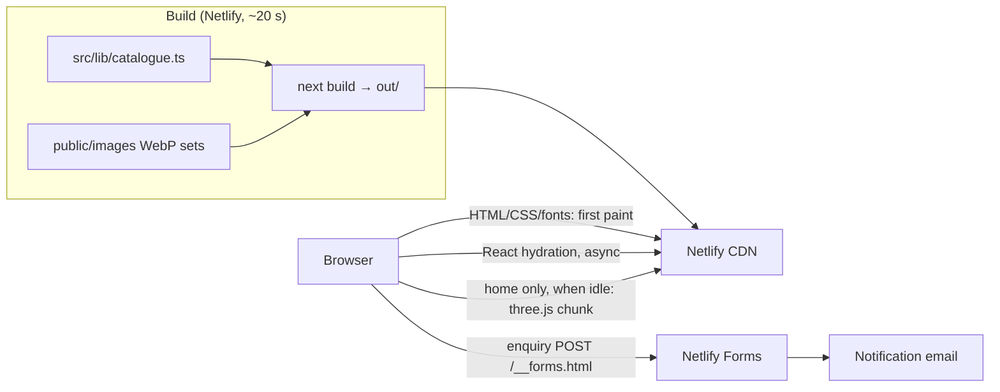

# Architecture

## Overview

A fully static corporate site. At build time, Next.js renders every page to HTML: 6 main pages, 8 category pages, 27 product pages, the brand sheet and the 404. Netlify's CDN serves the HTML, CSS, JS and images. There is no server, database, CMS or login.

## Components

- **Content:** `src/lib/catalogue.ts` is the single content source. It holds the 8 categories, 27 products, statements, markets, dosage forms and reasons. `src/lib/site.ts` holds the routes and the verified contacts. Unknown facts are `null` and are not rendered.
- **Pages:** `src/app/(site)/*` share the header, footer and motion runtime. `src/app/brand/` has its own layout.
  - `generateStaticParams` produces the category and product pages.
  - `dynamicParams = false`, so any other slug is a 404.
- **Client islands** (the only React code that runs in the browser besides the framework):
  - `Header` (menu, theme);
  - `SiteRuntime` (scroll reveals, parallax, word reading, marquee speed, page fades);
  - `HeroStage` plus `logo3d.ts` (the 3D logo);
  - `PortfolioTabs`, `ProductsBrowser` (in-place filtering with real URLs) and `ContactForm`;
  - the brand-sheet canvases.
- **Motion:** intro motion is CSS (`globals.css`) and runs on first paint. Scroll-driven motion is set up after hydration. Everything is off under `prefers-reduced-motion`.
- **Images:** `scripts/optimize-images.mjs` turns the handoff originals into responsive WebP sets and a typed manifest. `<Picture>` renders `srcset`/`sizes`, lazy by default.

## Trust boundaries

- **Enquiry form:** the only user input. It's validated in the browser, then Netlify Forms applies its spam filter and the honeypot. No data is stored by the site itself.
- **Theme preference:** `localStorage`, read by an inline script before paint.
- **Third parties:** the public pages load none. The internal GLB/OBJ exporter (`/brand/Logo3D.html`, the designer's verbatim tool) loads three.js from unpkg with SRI.

## Deployment topology

- **Netlify:** builds on push to the deploy branch and publishes `out/`.
- **Headers and redirects:** set in `netlify.toml`.
- **Previews:** every deploy is `noindex` until launch.

## Scaling path

Nothing needs to scale: the site is static files on a CDN.
- If the client later needs to edit content themselves, add a git-based CMS that writes to `catalogue.ts`/JSON.
- If spam or abuse appears on the form, add a Netlify Function with server-side validation and rate limiting.
