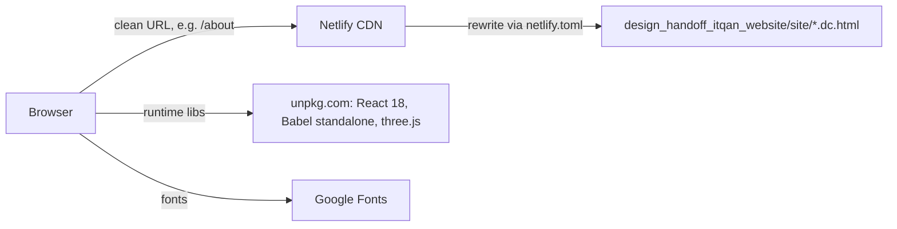
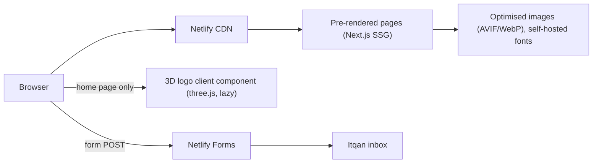

# Architecture

## Now: static design preview (Phase 1)

- **Pages.** Each `*.dc.html` file is a Claude Design page. `support.js` is the page runtime, and every folder has an identical copy. It loads React and Babel from unpkg and renders the page's template and logic in the browser.
- **Content.** `shared/catalogue.js` is the single content source: 8 categories, 27 products, dosage forms, reasons, markets and contacts. It exposes `window.ITQAN`.
- **3D logo.** `shared/itqan-logo3d.js` and `shared/logo-voxels.js` sample `logo.png` into voxels and draw them with three.js (InstancedMesh).
- **Server.** None. There is no backend, database or form handling. The contact form opens `mailto:`.
- **Trust boundary.** None beyond the browser. The page takes no user input apart from the contact form, and that never leaves the device except through the user's own mail app.

## Target: production (Phase 2+)

- Next.js App Router, TypeScript strict, Tailwind v4, Motion. Every route is statically generated, and there are no runtime CDN dependencies.
- `lib/catalogue.ts`, typed and ported from `catalogue.js`, stays the single content source. `/products/[slug]` is generated from it.
- **Only one trust boundary:** the enquiry form. Its data is untrusted and handled by Netlify Forms, which provides spam filtering and a honeypot. A Netlify Function is used only if stronger validation or rate limiting is needed (ROADMAP Phase 4).
- **Not planned:** a database, authentication, CMS or admin area. None is justified for a 6-page corporate site with 27 products. If the client needs to edit content themselves later, evaluate a git-based CMS then.
